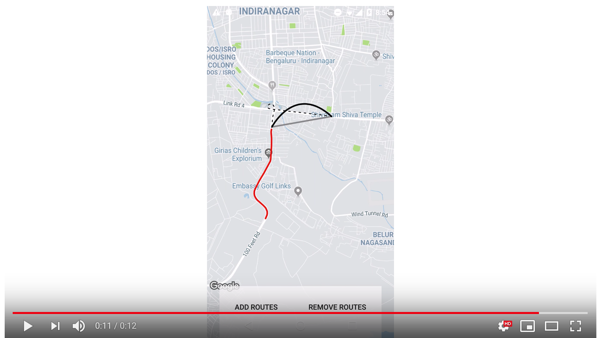

<p align="left"></p>
<p align="left"></p>
<p align="left">Smooth route animation over Google maps. Uses projection from Google maps to draw a route on an overlay layout. Can add multiple routes with different sytles while supporting pan and zoom of maps.</p>
<p align="left">
  <a href="https://travis-ci.org/amalChandran/trail-android/"></a>
  <a href="https://android-arsenal.com/details/1/6435"> </a>
  <a href="https://github.com/angular/angular.js/blob/master/LICENSE"></a>
</p>

<p align="left">
  (Gif running @ 10fps. Check the video on youtube.)
</p>

<p align="left">
  
</p>
<p align="left">
  <a href="https://www.youtube.com/watch?v=ENOcDomhCPw"></a>
</p>

## Setup
1. Add jitpack to the root build.gradle file of your project at the end of repositories.
```
allprojects {
    repositories {
      ...
      maven { url 'https://jitpack.io' }
    }
}
```
2. Add the dependency
```
implementation 'com.github.amalChandran:trail-android:v1.5'
```
## Usage
Place RouteOverlayView over your google map layout in xml. Make sure that the routeoverlayview covers the map completely. This is the view in which the routes will be drawn.

```
<FrameLayout xmlns:android="http://schemas.android.com/apk/res/android"
  xmlns:app="http://schemas.android.com/apk/res-auto"
  xmlns:tools="http://schemas.android.com/tools"
  android:layout_width="match_parent"
  android:layout_height="match_parent">
  <fragment
    android:id="@+id/map"
    android:layout_width="match_parent"
    android:layout_height="match_parent"
    android:name="com.google.android.gms.maps.SupportMapFragment"/>
  <com.amalbit.trail.RouteOverlayView
    android:id="@+id/mapOverlayView"
    android:layout_width="match_parent"
    android:layout_height="match_parent"/>
</FrameLayout>
```
In your activity, create routes with three predefined styles as of now.

```
    Route normalRoute = new Route.Builder(mRouteOverlayView)
        .setRouteType(RouteType.PATH)
        .setCameraPosition(mMap.getCameraPosition())
        .setProjection(mMap.getProjection())
        .setLatLngs(mRoute)
        .setBottomLayerColor(Color.YELLOW)
        .setTopLayerColor(Color.RED)
        .create();
```
To make sure that the overlay moves along with the Google maps movement we need to add a hook from its cameramovelistener.
```
      mMap.setOnCameraMoveListener(() -> {
            mRouteOverlayView.onCameraMove(mMap.getProjection(), mMap.getCameraPosition());
          }
      );
```


## License
MIT © Amal Chandran

## Logo
by <a href="https://dribbble.com/jibinscribbles">Jibin</a>
