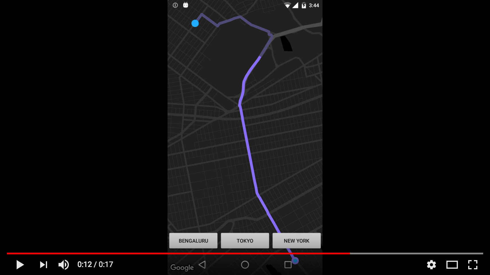

<p align="center"></p>
<p align="center"></p>
<p align="center">Smooth route animation on google map. Uses projection from google map to draw route on canvas. Supports pan, zoom and rotation of maps.</p>
<p align="center">
  <a href="https://travis-ci.org/amalChandran/trail-android/"></a>
  <a href="https://android-arsenal.com/details/1/6435"> </a>
  <a href="https://github.com/angular/angular.js/blob/master/LICENSE"></a>
</p>

<p align="center">
  (Gif running @ 10fps. Check the video on youtube.)
</p>

<p align="center">
  
</p>
<p align="center">
  <a href="https://youtu.be/H_BWRTf0d8g"></a>
</p>

<p align="center">
  <a href="https://play.google.com/store/apps/details?id=com.amalbit.animationongooglemap"></a>

## Usage
Replace SupportMapFragment with TrailSupportMapFragment.

```
Usage
   trailSupportMapFragment.setUpPath(routeLatLng, mMapInstance);
```

## Created by
Amal Chandran

## License
MIT © Amal Chandran
Google Play and the Google Play logo are trademarks of Google LLC.

## Logo
by <a href="https://dribbble.com/jibinscribbles">Jibin</a>

##
Big thanks to <a href="https://github.com/davidganster">Davidganster</a> for his additive animation <a href="https://github.com/wirecube/android_additive_animations">library.</a>

