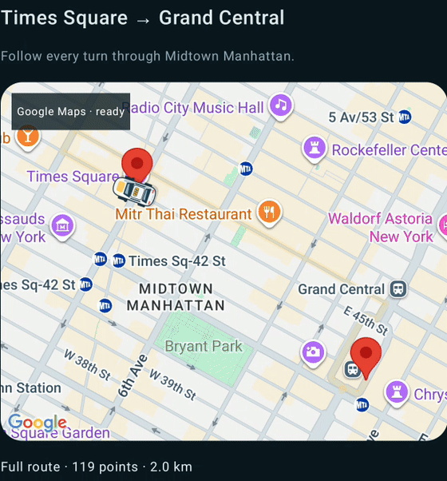
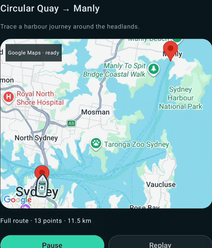
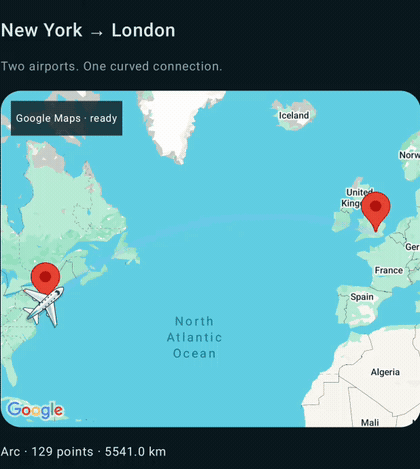
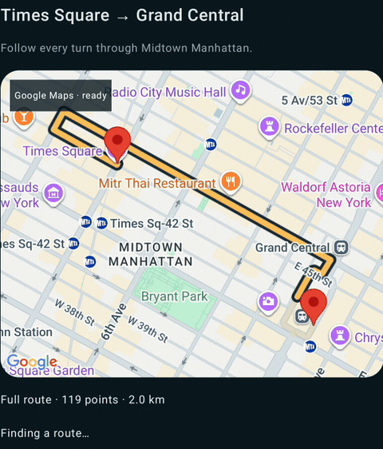
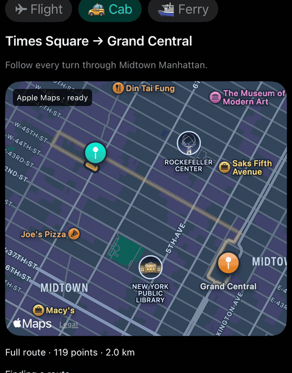

# Trail for Android

**Routes with character. Small Kotlin APIs. Native map anchoring.**

**Platforms:** **Android / Kotlin** · [iOS / Swift](https://github.com/amalChandran/trail-ios)

Trail draws and animates lines on Android Canvas, Compose and Google Maps. Describe an effect with a typed DSL, reuse it as a named preset, and extend it with ordinary Kotlin interfaces. No annotation processor, reflection or plugin registry.

**2.0.0-alpha02 is a local release candidate.** Maven Central publication is pending. The playground is an example app for local testing. [Java → Kotlin migration](docs/MIGRATION.md) · [Install locally / distribution](docs/DISTRIBUTION.md) · [Compiled examples](docs/examples/Android.md) · [API rules](docs/API_GUIDE.md) · [Verification](docs/VERIFICATION.md)

The independently native Swift implementation lives in [**trail-ios**](https://github.com/amalChandran/trail-ios). It has its own root Swift package; Android consumers do not download Swift sources or an iOS runtime.

## See it on real maps

These GIFs are recordings of the native playground, with provider attribution retained.

### Cab · Times Square → Grand Central



### Ferry · Circular Quay → Manly



### Flight · JFK → Heathrow



The cab uses a complete 119-point road-route snapshot. Flight and ferry paths are illustrative connections, not navigation or official service tracks. Try **Full route**, **Two points**, **Arc** and **Great circle** in the app. [Geometry and sample provenance](docs/MAPS.md) · [Recording provenance](docs/media/README.md)

## One effect, one line to render

```kotlin
val deliveryTrail = trailEffect {
    stroke(TrailColor.Blue, width = 6.0)
    reveal(2.seconds)
}

TrailCanvas(path, effect = deliveryTrail)
```

On an existing Google Map, put Trail **inside the map content**:

```kotlin
GoogleMap(cameraPositionState = camera) {
    GoogleMapsTrail(route, camera, effect = deliveryTrail)
}
```

The route and optional vehicle are native geographic map objects. The map engine transforms them during pan, zoom, bearing and tilt, avoiding the separate-screen-overlay feedback that caused sway. An SDK snapshot regression checks their actual pixels at geographic anchors. [Map integration](docs/MAPS.md)

```kotlin
GoogleMapsTrail(
    route, camera, effect = deliveryTrail,
    vehicle = GoogleMapsTrailVehicle(icon = cabIcon)
)
```

Supply a cached, up-facing bitmap descriptor; Trail centers it, follows the route head and turns it with the route. The sample's tiny top-down vector fleet is app-only, so every SDK consumer does not pay for artwork they do not use. [Vehicles](docs/VEHICLES.md)

## Loading arc → directions route

Show a travelling arc while your service loads directions; morph it onto every road corner when the response arrives. It handles stale responses, cancellation, failure, retries, reduced motion and backgrounding.

| Google Maps / Kotlin | Apple Maps / Swift |
| --- | --- |
|  |  |

```kotlin
val transition = rememberTrailRouteTransition(origin, destination)
LaunchedEffect(transition) {
    val request = transition.request
    try { transition.resolve(request, directions.fetchRoute()) }
    catch (cancelled: CancellationException) {
        transition.cancel(request)
        throw cancelled
    }
    catch (failure: Exception) { transition.fail(request) }
}
```

Bind `transition.route`, using `TrailAnimations.loading()` during `Loading` and your reveal preset during `Ready`. Networking and error/retry UI belong to your app. The [complete compiling example](docs/examples/Android.md#loading-arc-to-directions-route) supplies the map, effect, imports and controller wiring. The playground uses a delayed bundled response, so you can try it without a directions account.

## Add your own style or motion

```kotlin
class MyRouteStyle(private val color: TrailColor) : TrailLineStyle {
    override fun draw(context: TrailDrawContext) {
        context.stroke(TrailColor.White, width = 10.0)
        context.stroke(color, width = 6.0)
        context.chevrons(color, size = 8.0, spacing = 28.0)
    }
}

val branded = trailEffect {
    style(MyRouteStyle(TrailColor.Mint))
    reveal(2.seconds)
}
```

A motion plugin implements `TrailAnimation.sample(TrailTime)` and returns bounded visual state. Seeking must give the same frame as normal playback. The [independently compiled plugin](android/sample-plugin/src/main/kotlin/dev/trail/plugin/MetroStyle.kt) demonstrates both contracts.

One style and one animation per layer. Use explicit `layer { }` for simultaneous effects or `sequence { }` for ordered clips. Ambiguous duplicates give actionable errors. The optional catalog contains **8 styles × 12 motions**; Canvas and native map content consume the same prepared commands.

## Keep the integration small

Pick `trail-android` for Views, `trail-compose` for Compose, or `trail-google-maps` for Google Maps. Add `trail-effects` only for the larger catalog. The core has no UI, map, networking or reflection dependency.

The release probes compare the same View and Google Maps hosts with and without a two-point Trail reveal. See the measured artifact bytes, R8 deltas, test conditions and limits in [PERFORMANCE.md](docs/PERFORMANCE.md). They are not whole-app download-size promises.

## Run it

[Step-by-step example flows](docs/LOCAL_TESTING.md)

```sh
./scripts/run-android.sh
./scripts/check.sh
TRAIL_ANDROID_SERIAL=emulator-5554 ./scripts/test-android-ui.sh
./scripts/release/prepare-android.sh
./scripts/release/test-consumer.sh
```

Java 17, Android SDK 36, Kotlin 2.3.20; minimum Android API 24. Put your restricted Maps key in ignored `android/local.properties` as `MAPS_API_KEY=...`. A missing key is an explicit skipped live-map test, not a passing substitute. No directions service is needed for the bundled journeys.

[LLM integration contract](llms.txt) · [Legacy Java migration](docs/MIGRATION.md) · [MIT license](license.md)

The optimized example APK is `artifacts/release/trail-studio-example.apk`, signed with the standard local debug certificate. The example uses `dev.trail.playground`; there is no store release workflow.
