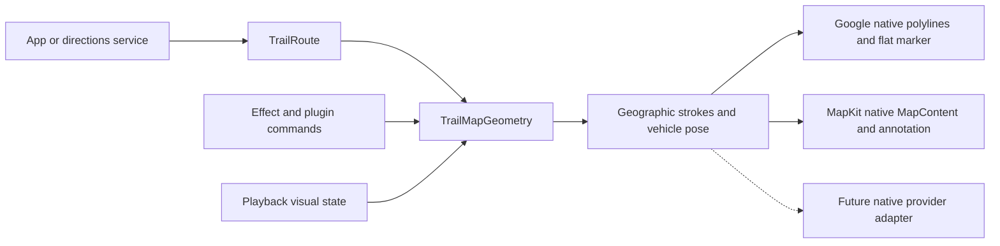

# Native maps, Google and Apple first

`TrailRoute`, effects, animation plugins, geometry morphs and playback are provider-neutral. Google Maps Android and Apple MapKit are the first adapters. Maps and tiles remain owned by the application/provider.

## Default: render inside the map

Android: `GoogleMapsTrail(route, camera, effect = effect)` **inside** `GoogleMap { }`. It uses native polylines and a centered flat marker, not a sibling Compose Canvas. Reuse one controller per binding; passing `active = false` freezes a retained offscreen map. If your screen waits for `onMapLoaded`, pass that readiness as `active` so animation does not keep the initial map continuously changing.

iOS: `TrailMap(route:effect:)` is a native MapKit convenience host. An existing map uses `TrailMapContent(geometry:playback:unitsPerPoint:)` inside `Map { }` and `.trailPlayback(playback)` on the Map. For patterned styles, supply Mercator meters per point from the visible map rect divided by view width; the journey sample contains the full conversion. Solid strokes and a basic reveal do not need a scale estimate. Vehicle artwork is an app-owned native `Annotation`, at `TrailMapGeometry.pose(at:)`.

The provider applies camera transformations to geographic objects in its renderer. Pan/zoom cannot leave an independently projected screen route behind. On Android, a native SDK snapshot regression checks route and vehicle pixels under 12 camera configurations. iOS UI checks exercise six rapid alternating swipes while paused. These are emulator/simulator observations; physical-device frame pacing and extreme pitch still need release acceptance.

The map may still be downloading tiles when route content is available. “Ready” in the sample describes its map binding, not a network SLA. The Google sample fits bounds from `MapEffect` once the SDK and viewport exist, before waiting for tiles, and starts playback after `onMapLoaded`. Long flights allow minimum zoom 0. It does not fetch a world overview and then wait to choose the actual journey.

## Choose the geography explicitly

| Factory | Meaning |
| --- | --- |
| `TrailRoute(id, coordinates, revision)` | Preserve a complete ordered route, including every intermediate road turn |
| `direct` | A two-point projected connection; no road routing |
| `arc` | Decorative quadratic connection in unwrapped Mercator space |
| `greatCircle` | Sampled shortest spherical connection, useful for flights |
| `encodedPolyline` | Decode an already-fetched directions response, precision 5 or 6 |

JFK → Heathrow uses a 129-point decorative arc. Times Square → Grand Central uses all 119 points of a captured road route. Circular Quay → Manly uses 13 illustrative harbor waypoints. See [source and licensing](../samples/README.md).

Inputs validate latitude/longitude, nonblank IDs, nonnegative revisions, a 100,000-coordinate budget, generated-curve sampling limits and ambiguous antipodes. Native geometry uses Mercator distance for visual progress; `distanceMeters` remains an approximate spherical distance. Date-line crossings split into separate contours, preventing a stroke across the wrong side of the world. High latitudes clamp to the Mercator limit for native drawing.

## Loading and route replacement

`TrailRouteTransition` is a deterministic core state machine. `rememberTrailRouteTransition` and `TrailRouteTransitionState` bind it to each UI framework.

1. `begin(from,to)` returns a request token and an arc; retain the token before starting async work.
2. `resolve(request,route)` accepts only the current loading request. The resolved endpoints must be within 150 m of the requested endpoints, allowing road snapping. Malformed/mismatched responses throw without corrupting the loading state.
3. The default 650 ms morph uses smooth departure/arrival easing. It preserves target vertices and uses unwrapped coordinates through the date line. The final frame is the original route, not a permanently resampled approximation.
4. Late, duplicate, cancelled or foreign responses return false. `fail` and `cancel` stop loading without drawing a made-up road. The app owns its error text and retry action.
5. Reduced motion settles immediately; background/inactive bindings freeze elapsed animation time.

Core states are `Loading`, `Morphing`, `Ready`, `Failed`, `Cancelled` (lowercase cases in Swift). A retry creates a new token. Changing requests during a morph discards the previous morph. Loading is visual feedback, not a hidden directions client. The compiled example and app demonstrate the complete flow.

## Provider extensions and capability limits

A future provider adapter consumes geographic `TrailMapStroke` values and `TrailMapPose`, applying width/color/dash/caps and native coordinate anchors. It must own only its provider objects and clean them up with the screen. It must not replace an application's camera callbacks, start a second playback clock or register plugins globally. SDK credentials, camera policy, markers and attribution stay outside TrailCore.

Native stroke width is in dp / Apple points. Pattern spacing and chevron geometry use an approximate map scale; perspective affects apparent spacing at steep pitch. Google lacks a dash-offset property, so its adapter rotates the repeating pattern. MapKit supports dash phase directly. Native map z-order is provider-specific; neither adapter promises arbitrary interleaving with every basemap label. Google vehicle markers are flat on the map; SwiftUI annotations retain their provider's billboard presentation and rotate to the route heading.

A layer is limited to 8,192 native primitives and chevrons to 2,048 placements. These are safety budgets, not performance targets. Dense gradient/comet combinations and animated 100k-point routes can be expensive. Measure the host app before shipping them. The full static route retains its original coordinate buffer and does not rebuild 100k vertices on each tick.

The older `GoogleMapsTrailOverlay`, `TrailMapOverlay`, `TrailMapAttachment` and `TrailProjectedOverlay` remain explicit **screen-space** tools for custom Canvas integrations. Their camera callbacks and UI frame clocks are separate from the map renderer. They are not the default solution for tightly anchored routes. `TrailProjection` remains useful for those adapters; use local dp/points, all-or-nothing readiness, matching viewport bounds, no auto-fit, and explicit camera/layout invalidation.

Before adding another provider, verify live native pixels/coordinates, density, camera gestures, zoom/bearing/tilt, seams, readiness, lifecycle, pause/seek, route replacement, hit testing and teardown. OpenStreetMap requires a selected map renderer and tile policy; it is not itself a rendering SDK.
