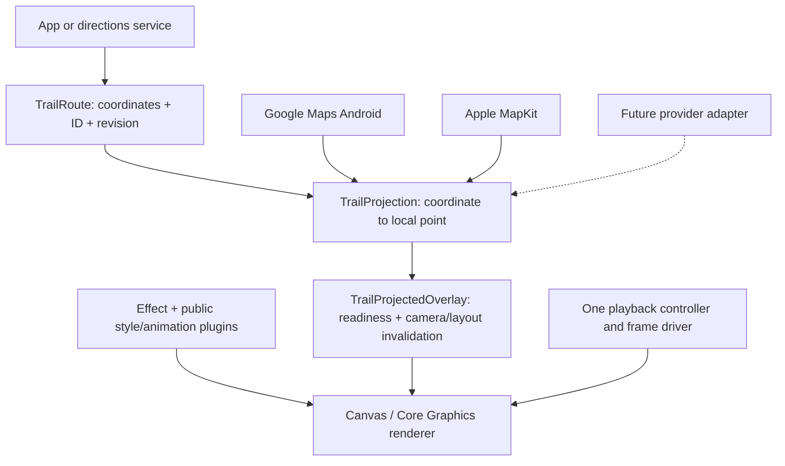

# Maps: Google and Apple first

Trail's route data, effects, plugins and playback do not import either map SDK. The first adapters are Google Maps Compose on Android and Apple MapKit on iOS. Additional providers are deferred until these integrations have been exercised in consumer apps.

Changing providers means replacing the **map view and its thin adapter**. The same route, effect, plugin and playback code can be reused. Camera configuration, native markers, map credentials and attribution remain responsibilities of the host app/provider. Trail does not pretend their SDK APIs are interchangeable.

## Start with the sample

Run `./scripts/run-ios.sh` or `./scripts/run-android.sh`, then open **Map journeys**.

| Journey | Coordinates | Default drawing | What to try |
| --- | --- | --- | --- |
| Flight | JFK, New York → Heathrow, London | Decorative arc, sampled into 129 points | Compare Arc, Two points and Great circle; scrub the aircraft along the line |
| Cab | Times Square → Grand Central, Manhattan | Complete 119-point road-route snapshot | Full route follows every intermediate point; Two points deliberately removes turns |
| Ferry | Circular Quay → Manly Wharf, Sydney | 13 hand-authored harbor waypoints | Compare the harbor path with a simple connection; try dashed/comet styles |

Each sample has endpoint markers, camera fitting, distance, playback, a moving vehicle, eight line styles, twelve motions and reduced motion. Journey coordinates are bundled, so no directions account is needed. Basemap imagery still comes from the map provider. The ferry waypoints illustrate a harbor journey; they are not an official sailing trace. Flight connections are illustrative, not operational flight tracks. See [data provenance](../samples/README.md).

The Google journey screen sets `MapProperties(minZoomPreference = 0f)` so a long flight can fit both endpoints; Maps Compose's default minimum of 3 can clip them in a small viewport. Camera fitting remains sample/host-app behavior, separate from the Trail adapter. Live Google and Apple checks and their limits are recorded in [VERIFICATION.md](VERIFICATION.md).

Google Maps requires your own configured key. Put `MAPS_API_KEY=...` in the ignored `android/local.properties` and rebuild; do not put it in source. Enable Maps SDK for Android and follow Google's [account, API and key setup](https://developers.google.com/maps/documentation/android-sdk/get-api-key). Restrict the key to the sample package `dev.trail.playground` and its signing certificate; `./gradlew :playground:signingReport` prints the certificate fingerprint. The live Google SDK test is reported as skipped when no key is present.

## Choose the geometry explicitly

| Construction | Meaning |
| --- | --- |
| `TrailRoute(id, coordinates, revision)` / `TrailRoute(id:coordinates:revision:)` | Preserve a complete route in the supplied order; never connect just its endpoints by accident |
| `TrailRoute.direct` | Two endpoints joined in the map's projected coordinate space |
| `TrailRoute.arc` | Decorative quadratic curve in unwrapped Mercator space; signed `bend` controls direction/amount |
| `TrailRoute.greatCircle` | Sampled shortest spherical connection; useful for flight visualizations |
| `TrailRoute.encodedPolyline` | Decode a directions response at precision 5 or 6 into the same route model |

The [Android](examples/Android.md) and [Swift](examples/iOS.md) examples compile all five forms. Route constructors validate geographic input; Kotlin throws `IllegalArgumentException`, Swift throws `TrailError`. Empty/singleton/repeated coordinates are safe. IDs must be nonblank, revisions nonnegative, and input is limited to 100,000 coordinates. Generated curves accept 2–2,048 intervals; the default 128 intervals yield 129 points. Arc bend is finite and in −1…1. Arc endpoints must be within ±85.051129° latitude. Exact antipodal great-circle endpoints require an intermediate waypoint because their shortest connection is not unique.

`distanceMeters` is a spherical approximation using a mean Earth radius of 6,371,008.8 m. It is the length of the chosen sampled geometry, not a travel-time estimate. Bounds choose the smallest enclosing longitude interval. Crossing ±180° produces separate contours with no drawn bridge or added animation distance across the seam. Very high latitudes, world copies, globe modes and extreme pitch still require each provider's own acceptance tests; splitting alone does not make every projection correct.

## The provider contract

1. Project geographic coordinates through the **live map SDK** into the overlay's local coordinate system. Return Android dp / Apple points. Google returns local physical pixels, so its adapter divides by density exactly once. Apple's conversion already returns points. [Google projection contract](https://developers.google.com/android/reference/com/google/android/gms/maps/Projection), [Apple MapProxy](https://developer.apple.com/documentation/mapkit/mapproxy).
2. Return `null`/`nil` until conversion is available. If any route point is unavailable, Trail withholds the whole path. Skipping a middle point would draw a false connection.
3. Notify `TrailProjectedOverlay` when the camera, padding/insets or projection changes. Compose accepts a revision value; SwiftUI uses an incrementing integer. Layout changes are observed by the shared binding. Match the map's exact bounds; do not apply `fit` to geographic coordinates.
4. Keep the route ID stable and increment its revision when replacing its geometry. Camera movement only reprojects; it must not rebuild the effect or reset playback.
5. Preserve gesture handling, app-owned map callbacks and attribution. Dispose the binding when its host disappears. UIKit consumers retain `TrailMapAttachment`, forward camera/layout changes and explicitly call `detach()`.

An adapter is a projection closure plus camera/layout/lifecycle wiring, not a second animation engine. The compiler-checked **Provider-neutral overlay contract** example shows the minimal wrapper for another map SDK. Porting to Google Maps iOS or a chosen OpenStreetMap renderer should require no changes to either core. An OpenStreetMap integration still needs a concrete renderer and tile-provider policy; OpenStreetMap data itself is not a UI SDK.

## Ownership and extension rules

Effects and routes are immutable configuration. A controller belongs to one visible binding. A style plugin records bounded drawing commands once; a motion plugin samples normalized time. Neither plugin knows about maps or owns a timer/network client. The shared Canvas host owns the sole frame driver and freezes it when paused, inactive, offscreen, unprojectable or reduced-motion.

Effect-only bindings own playback and restart for a new route key. Supplying a controller means the app owns route replacement on **both platforms**; call `replay()` or construct a controller keyed by the route when desired. `TrailMapAttachment.updateRoute` preserves position by default; pass `replay: true` to restart when the key changes. Effect updates preserve progress and play/pause intent.

The overlays draw above native map content. They cannot place route strokes between a native road and its label, or behind individual native markers. Put app controls above the overlay, and keep provider attribution visible. A future native-map-layer backend would be a separate rendering capability, with its own tests; the current adapters do not promise it.

## Provider acceptance before adding the next map

Require tests for coordinate round trips, density, bearing/tilt/zoom, resize and safe-area offsets, date-line seams, missing projection, route replacement while paused, background/resume, hit testing, and repeated attach/detach. Reuse the shared geometry/raster fixtures; add real-SDK checks for the new provider. Do not accept a compiling adapter as proof of visual alignment. Current executed evidence and remaining gaps are recorded in [VERIFICATION.md](VERIFICATION.md).
