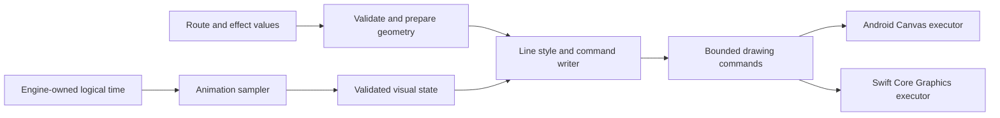

> Historical proposal. The selected, implemented API is documented in [the current API guide](../API_GUIDE.md). Examples here may be unimplemented.

**Trail — approachable APIs, extensible effects, and native Kotlin/Swift**

Design revision · 14 September 2026 · Prepared for Amal's “trail 2.0” task

**Decision proposed:** ship two native libraries, Kotlin for Android and Swift for iOS, implementing one documented behavior contract. Make drawing styles and animation samplers public extension points from the first stable release. Build the bundled effects using those same extension points. Make ordinary adoption work without learning the plugin architecture.

Historical design note: implementation began on 19 September; see the [current README](../../README.md) for implemented scope and alpha limitations. This revises the original relaunch proposal. It replaces its earlier recommendations to defer iOS and keep all rendering extension interfaces internal. This is a proposed design, with illustrative API sketches; none of the new APIs have been implemented or compiler-validated. Amal subsequently requested multiple API candidates: the [API comparison](API_CHOICES.md) is the current decision document for syntax, including DSLs, named presets, fluent modifiers, and generated annotations/macros. The examples below express the intended responsibilities, not a selected final spelling.

Working provider choice: Google Maps on Android and **MapKit first on iOS**, pending Amal's provider preference. Both engines and plugin contracts stay independent of those providers. A Google Maps iOS adapter is an additional integration if required; it does not require a different animation engine.

**1. Product and usability requirements**

Trail should support three progressively deeper workflows:

| Developer need | Public experience | What Trail handles |
| --- | --- | --- |
| “Animate this route.” | A route, a map binding, and a named preset with sensible defaults. | Frame scheduling, projection readiness, drawing, pause on inactivity, cleanup. |
| “Match my application.” | Typed style parameters, playback controls, layered styles, sequences, and accessible defaults. | Composition rules, units, route identity, state preservation, invalidation. |
| “Create a reusable effect.” | Implement a small interface/protocol, pass the resulting value to the same API, optionally distribute it as a package. | Geometry helpers, normalized time, drawing commands, resources, validation, and test utilities. |

The adoption bar is a developer producing a working animated route in ten minutes, assuming their map already works. The extension bar is a developer implementing a two-layer custom stroke in thirty minutes using public documentation, without reading Trail's internal source. Validate these with at least three developers who did not design the API. If nobody is available, use independent consumer projects and report the absence of usability feedback.

The basic path must not require a plugin manager, registration calls, dependency injection framework, custom renderer, coroutine scope, display link, or projection math. A playback controller becomes necessary only when the application needs imperative controls such as pause, seek, or replay.

Use examples as API acceptance tests. Document actual installation, imports, route validation, map placement, and ownership before showing advanced customization. Small code is useful only when the reader can understand what it does; Swift's API guidelines explicitly prioritize clarity at the call site. [Swift API design guidelines](https://www.swift.org/documentation/api-design-guidelines/).

**2. Choose direct extensions with typed composition**

| Approach | Benefit | Cost | Recommendation |
| --- | --- | --- | --- |
| Open style/animation contracts with typed composition | Small extensions, predictable behavior, straightforward Kotlin/Swift packages, easy automated tests. | Requires carefully designed inputs, output validation, and compatibility promises. | **Use as the stable extension architecture.** |
| Public renderer subclass hierarchy and raw graphics access everywhere | Maximum immediate platform drawing freedom. | Plugin authors inherit lifecycle, projection, threading, and backend coupling; changes become hard to make safely. | Offer limited, platform-specific advanced hooks only after the normal contract is proven. |
| General runtime plugin registry with manifests, discovery, and dynamic loading | Central discovery and external configuration. | Much more lifecycle/version/loading complexity; different platform constraints; poor fit for normal application dependencies. | Keep discovery as documentation and package distribution. Do not require a runtime registry. |

Here, a “plugin” is an ordinary object/value implementing Trail's public contract. A community package can provide one or many such values. Applications import the package and pass the effect directly. These are animation-library extensions, not Gradle build plugins or Swift Package Manager build-tool plugins.

The optional future gallery can index plugin documentation and compatibility metadata. A functioning ecosystem does not require executing downloaded plugin code at runtime.

**3. Design the consumer API in layers**

Use the same concepts in both languages, with idiomatic spelling:

| Concept | Responsibility |
| --- | --- |
| `TrailRoute` | Immutable, validated path with a stable ID and geometry revision. |
| `TrailLineStyle` | How a route or visible portions of it are painted. |
| `TrailAnimation` | A pure mapping from normalized time to visual state. |
| `TrailAnimationSpec` | A sampler plus duration/repeat configuration, or an explicitly composed timeline. Factories under `TrailAnimations` return this type. |
| `TrailEffect` | An immutable style/layer description together with its animation specification; reusable without sharing mutable playback. |
| `TrailPlayback` | Stateful play, pause, seek, replay, repetition, and lifecycle intent. |
| Map integration | Translates route geometry into the host's drawing coordinates and preserves host map behavior. |

Keep a solid blue stroke as the default style and a static route as the default animation. One-shot reveal is an explicit option with a default duration; infinite repetition is always explicit. Empty input displays nothing, one-point input displays no line, and invalid/non-finite coordinates fail route validation with a useful error. An optional point marker is a separate feature. This allows applications to render while their route is loading without inventing a two-point placeholder.

**Android adoption sketch** — `route` is already validated; ordinary Google Maps setup and imports are omitted here, and must appear in the compiled quickstart:

```kotlin
val camera = rememberCameraPositionState()

Box(Modifier.fillMaxSize()) {
    GoogleMap(
        modifier = Modifier.matchParentSize(),
        cameraPositionState = camera,
    )
    GoogleMapsTrailOverlay(
        route = route,
        cameraPositionState = camera,
        animation = TrailAnimations.reveal(duration = 2.seconds),
        modifier = Modifier.matchParentSize(),
    )
}
```

The no-controller overload remembers playback for that route binding and starts the explicitly supplied animation once when ready. Ordinary recomposition does not replay it. A changed geometry revision resets it according to the documented replacement policy. A changed style preserves progress. Changing animation configuration preserves normalized progress by default; restarting requires `replay()` or an explicit reset identity. A controller overload offers the same rendering API and overrides automatic playback with the controller's intent.

For a self-contained demo or new screen, an optional `TrailMap` convenience view may own its map. The primary overlay API must attach to an existing map; the convenience view must never become the only adoption path.

**Swift adoption sketch** — the same presets are expressed using Swift arguments:

```swift
TrailMap(
    route: route,
    style: TrailStyles.solid(color: .blue, width: 6),
    animation: TrailAnimations.reveal(duration: .seconds(2))
)
```

This convenience view is MapKit-specific. Also ship a `TrailMapOverlay` for an existing SwiftUI `Map`, with its projection/camera binding made explicit, and an attachment adapter for an existing `MKMapView`. The iOS rendering experiment must prove that existing-map path before `TrailMap`'s convenience API is considered finished. Do not advertise an ordinary SwiftUI overlay as if it were a native `MapContent` element.

Convenience factories such as `TrailStyles.solid` and `TrailAnimations.reveal` produce values implementing the public contracts, with the latter wrapping a sampler in duration/repeat configuration. Custom extensions use the same `style` and `animation` parameters. Material, application networking, route fetching, and marker tracking services are not dependencies of the core.

**4. Make custom line styles genuinely small**

The minimal drawing extension is one operation. These signatures and examples are design sketches:

```kotlin
public interface TrailLineStyle {
    public fun draw(context: TrailDrawContext)
}

public class CasedBlueStyle : TrailLineStyle {
    override fun draw(context: TrailDrawContext) {
        context.stroke(color = TrailColor.White, width = 8.0)
        context.stroke(color = TrailColor.Blue, width = 5.0)
    }
}
```

```swift
public protocol TrailLineStyle: Sendable {
    func draw(in context: inout TrailDrawContext)
}

public struct CasedBlueStyle: TrailLineStyle {
    public init() {}

    public func draw(in context: inout TrailDrawContext) {
        context.stroke(color: .white, width: 8)
        context.stroke(color: .blue, width: 5)
    }
}
```

Adoption is simply `style = CasedBlueStyle()` in Kotlin or `style: CasedBlueStyle()` in Swift. No registration or map-provider dependency is involved.

`TrailDrawContext` is a scoped command writer. It is not a raw Canvas, `CGContext`, map, or application context. Its `stroke` operation uses the prepared route plus the current animation's visible windows, opacity, width multiplier, and dash phase. The two stroke calls therefore follow the same animation automatically. Call order determines drawing order, so the wider white stroke sits behind the blue stroke.

The context exposes documented helpers for path range extraction, point/tangent at route fraction, stroking/filling derived paths, vector stamps, and coordinate units. A plugin should not need to reimplement path measurement, antimeridian splitting, or projection to draw chevrons or a moving highlight. Backend paths and mutable buffers remain scoped to the invocation; retaining the context is invalid.

Width in these shared extension examples means logical display units: density-independent units on Android, points on iOS. Consumer convenience APIs accept `Dp` on Android and points on iOS. Projection and rasterization convert to device pixels at the boundary. Geographic distances use meters, angular values are explicitly labeled, and fractional path positions are in `[0, 1]`. Do not silently mix geographic distance with projected screen length.

Offer an optional preparation interface for effects requiring expensive geometry or assets. Preparation occurs once per relevant route/style revision, supports cancellation, and returns a binding-owned prepared object; it is not required for the common two-stroke example. A prepared session has an explicit release hook invoked exactly once on replacement/disposal. Geometry/CPU preparation may use worker threads; platform resources remain with their designated executor. Cache keys must include viewport changes for screen-dependent work.

**5. Make custom animation independent of clocks and views**

The animation extension calculates one frame of visual state. Scheduling, duration, playback direction, loops, and completion remain with Trail:

```kotlin
public interface TrailAnimation {
    public fun sample(time: TrailTime): TrailVisualState
}

public class QuadraticReveal : TrailAnimation {
    override fun sample(time: TrailTime): TrailVisualState {
        val fraction = time.progress * time.progress
        return TrailVisualState.reveal(to = fraction)
    }
}
```

```swift
public protocol TrailAnimation: Sendable {
    func sample(at time: TrailTime) -> TrailVisualState
}

public struct QuadraticReveal: TrailAnimation {
    public init() {}

    public func sample(at time: TrailTime) -> TrailVisualState {
        let fraction = time.progress * time.progress
        return .reveal(to: fraction)
    }
}
```

Usage configures the sampler with normal library helpers:

```kotlin
animation = TrailAnimations.custom(
    sampler = QuadraticReveal(),
    duration = 2.seconds,
)
```

```swift
animation: TrailAnimations.custom(
    sampler: QuadraticReveal(),
    duration: .seconds(2)
)
```

`TrailTime` contains normalized cycle progress, cycle index, local elapsed duration, playback direction, and an explicit deterministic seed where needed. A sampled endpoint is exactly 1 at one-shot completion; for repeating clips, a cycle boundary starts the next cycle at 0. The cycle index disambiguates the boundary. A random effect samples through a versioned, specified random helper so Kotlin and Swift do not depend on unrelated platform RNGs.

`TrailVisualState` has named channels: visible path windows, global opacity, width multiplier, normalized dash phase, and optional route-head fraction. A window may have a defined alpha profile, enabling a fading comet without allocating hundreds of subroutes. Constructors/factories enforce finite values and documented ranges. Empty windows mean no route is visible. Public configuration uses controlled factories so adding an optional capability does not require changing every plugin's constructor.

The pure sampler receives no live map, wall clock, coroutine scope, display link, or view. Identical inputs produce identical output regardless of sampling order. Scrubbing directly to 80% must agree with reaching 80% through playback. An advanced simulation that cannot satisfy this contract needs deterministic checkpoints and replay semantics; it cannot silently depend on which frames happened to render.

The quadratic example has independently checkable reference values: at progress 0, 0.25, 0.5, 0.75, and 1, its reveal endpoint is 0, 0.0625, 0.25, 0.5625, and 1. Both languages must pass these fixtures.

**6. Compose effects without unclear ownership**

Keep composition explicit:

| Operation | Defined behavior |
| --- | --- |
| Layer styles | Draw back-to-front in declaration order, inheriting the same visual state unless the layer explicitly supplies another animation. |
| Sequence clips | Total duration is the sum of finite clip durations and delays. Each clip gets local progress. An infinite clip may appear only last. Seeking selects the correct clip directly. |
| Parallel channels | Combine only non-conflicting declared channels. Two clips writing the same opacity or visible-window channel produce a configuration error. |
| Explicit independent layers | Use when two animations need to control the same kind of channel, such as two comet heads with separate opacity. Avoid implicit last-writer-wins rules. |
| Reverse / ping-pong / repeat | Provided by timeline wrappers, with exact endpoints and completion semantics. Plugins do not create their own repetition loops. |
| Stagger routes | Apply bounded start offsets across stable route IDs in a scene. This is a scene recipe, not a line-style method. |

Path shape is separate from paint and animation. A third, advanced geometry extension can prepare a canonical path from route data, for example a decorative arc or a schematic route. Define whether the result is geographic or decorative screen geometry and preserve a mapping to canonical route fraction. Any method unable to provide that mapping cannot claim geographical marker-following accuracy. Keep map-provider adapters a distinct advanced boundary so a new line style never has to implement them.

Default cancellation holds the last logical position and emits a cancellation result only when explicitly requested by the observing API. Disposal removes the binding and produces no subsequent visual or completion callbacks. Reduced motion substitutes an explicit static presentation: a full route for looping decoration/reveal, and the terminal hidden state for a deliberate erase. A display request for route information must still have an accessible static equivalent.

**7. Plan a substantial preset catalog without multiplying engines**

Target **20 named presets/recipes for the coordinated launch**: eight drawing styles and twelve motion recipes. They combine where their declared capabilities make sense; this is not a claim that every combination is useful or supported. Keep the simplest presets in a lean package and place expensive expressive effects in an optional effects product with the same public contracts.

| Drawing style | Purpose | Implementation requirement |
| --- | --- | --- |
| Solid | Clear default route | One measured stroke. |
| Cased | Contrast against busy maps | Layered strokes through the public style API. |
| Dashed | Distinguish route types | Logical-unit dash/gap sizes and stable phase. |
| Dotted | Alternative/discontinuous routes | Round dot semantics at consistent spacing. |
| Along-route gradient | Show direction or value change | Color follows arc length, not a simple screen-aligned rectangle gradient. |
| Glow | Emphasize a selected route | Bounded layered-stroke implementation; blur is an optional capability. |
| Chevrons | Show travel direction | Public point/tangent helpers and reusable vector stamps. |
| Tapered | Emphasize a travelling head or direction | Measured width profile, with joins and sharp turns tested. |

| Motion recipe | Purpose | Contract |
| --- | --- | --- |
| Reveal | Introduce a route | Visible range grows from start to endpoint. |
| Erase | Remove a route deliberately | Visible range shrinks to its terminal hidden state. |
| Ping-pong reveal | Compare directions | Timeline reversal with tested endpoints. |
| Comet | Show moving focus | Travelling window with an optional fading tail. |
| Multiple comets | Show distributed flow | Bounded independent windows and consistent phase offsets. |
| Dash flow | Show direction continuously | Phase animation; requires a dashed/dotted-capable style. |
| Opacity pulse | Highlight selection or attention | Bounded, slow opacity channel; no rapid flashing. |
| Breathing stroke | Subtle emphasis | Small width modulation around a stable base stroke. |
| Travelling spotlight | Highlight progress over a static route | Separate base and highlight layers. |
| Segmented chase | Show staged movement | Deterministic segment windows with documented spacing. |
| Reveal then flow | Introduce, then show direction | Finite reveal followed by explicit repeatable flow. |
| Staggered routes | Compare or introduce several routes | Scene-level ordering and bounded delays by route ID. |

The first alpha should contain solid, cased, dashed, reveal, and comet plus one external custom style and animation. Expand the catalog only after the extension contract is proven on both platforms. All twenty are launch targets with release gates, not existing capabilities.

Use the motion-design principles for a calm, readable default: one primary moving feature, restrained secondary emphasis, no obligatory glow/pulse stacking, and an explicit reduced-motion alternative. Decorative entrances can decelerate; continuous flow and distance-based travel must preserve their meaningful speed. Do not apply a UI entrance curve to GPS playback in a way that falsifies motion. Preset defaults are overridable and their duration ranges documented in the gallery.

Build an Android and iOS gallery with a scrubber, pause/replay, color/width/speed controls, camera movement controls, light/dark backgrounds, copyable native code, supported-backend labels, and a synthetic no-map preview. Show combinations by purpose—delivery tracking, route comparison, or attention—so developers can choose without understanding every mathematical primitive.

**8. Make robustness an engine responsibility**

The execution pipeline is:



Each native implementation owns its command objects and buffers. The diagram represents a common semantic contract, not a cross-language runtime or a per-frame JSON interchange.

| Risk | Required design |
| --- | --- |
| Hidden timers and animation restarts | One engine driver per visible binding/scene, with a supplied frame time and no plugin-owned scheduling. |
| Cache invalidation | Track route, style, viewport, density, and projection revisions. Cancel obsolete preparation and discard stale results. |
| Cross-route state leakage | Simple effects are immutable and reusable. Mutable prepared resources belong to a single binding/session. |
| Drawing-state pollution | Scope transforms, clipping, blend state, and resources. Reset state between plugins/layers. |
| Invalid plugin output | Validate finite coordinates, fractions, alpha, widths, and command counts; identify the offending plugin and binding in diagnostics. |
| Excessive output | Set documented per-frame command/vertex budgets and reject overflow. Geometry preparation has input-size limits and cancellation checks. |
| Missing backend support | Negotiate capabilities when attaching. Return a typed unsupported-feature result; use a fallback only when the application explicitly selected it. |
| Inactive screens | Freeze or cancel engine work according to lifecycle/visibility; no render loop remains because a plugin object is retained. |
| Inconsistent release evolution | Version the public extension contract, deprecate intentionally, and test old external plugins against a new library candidate. |

Debug builds can fail loudly on invalid output; production policy may report the fault once and hide the offending layer while retaining the rest. This policy covers validation failures and recoverable errors. An in-process plugin is ordinary application code: Trail cannot safely preempt an infinite loop, sandbox arbitrary code, or recover from every platform fatal error. Performance diagnostics and cooperative contracts are part of robustness, not a promise of isolation.

Optional native drawing hooks belong in platform packages and declare their backend requirements. They receive a scoped Canvas/CGContext only during a call, with state restoration and explicit lifetime rules. Keep them experimental initially; common gradients, dashes, stamps, and layered styles must work through the normal public drawing contract first.

**9. Build iOS entirely in Swift**

The Swift implementation owns its geometry, timeline, plugin contracts, rendering, and UI integration. The two libraries share specification documents and fixture data; Kotlin binaries, Kotlin/Native, and a language bridge are not part of the iOS product.

| Swift package product/target | Responsibility |
| --- | --- |
| `TrailCore` | Pure Swift route geometry, normalized time, playback evaluation, extension protocols, effect descriptions, and command model. Avoid UIKit/SwiftUI/MapKit dependencies. |
| `TrailRendering` | Core Graphics command executor and scoped native drawing extension support. |
| `TrailMapKit` | MapKit projection, native overlay bridge, UIKit attachment, viewport/lifecycle integration, and display-link ownership. |
| `TrailSwiftUI` | SwiftUI state and existing-map overlay integration; optional `TrailMap` convenience view. |
| `TrailEffects` | Expressive optional presets beyond the lean defaults. |
| `TrailTesting` | Test-only fake clock, recording draw context, contract tests, and fixture loader. |

One Swift package can expose several library products; consumers select the integration they need. Keep runtime products independent of DocC generation, test helpers, macro implementations, and the sample gallery. Distribute source through Swift Package Manager with semantic version tags and DocC documentation. Binary XCFramework distribution is a later, separately tested commitment if required.

Use a supported Swift 6 toolchain with concurrency checking. Propose iOS 17 as the initial UI integration floor, then verify the exact APIs and selected toolchain against an actual consumer before promising support. Keep core concurrency isolation explicit: UI playback ownership belongs on `@MainActor`; immutable frame/geometry values are `Sendable`; pure evaluators must not become implicitly UI-isolated by project defaults. [Swift concurrency guidance](https://www.swift.org/migration/documentation/swift-6-concurrency-migration-guide/dataracesafety/).

Compare two native iOS rendering approaches during the initial experiment:

| Approach | Strength | Required proof |
| --- | --- | --- |
| `MKOverlayRenderer` with Core Graphics | Map-owned geometry and overlay integration; useful for UIKit and a SwiftUI wrapper around a native map. | Per-frame invalidation cost, tiled rendering seams, animated style support, and concurrency. |
| SwiftUI Canvas overlay or UIKit overlay surface using the Core Graphics executor | Consistent per-frame effect model and rich custom drawings over an existing map. | Camera synchronization, local coordinate conversion, attribution/controls, and surface ordering. |

Do not force Swift to choose Android's renderer strategy. Select the best native host after equivalent tests while keeping the same style and motion semantics. SwiftUI's `GraphicsContext.withCGContext` allows Core Graphics drawing within a scoped closure, which can reuse rendering code; that context cannot be retained beyond the call. [Core Graphics bridge](https://developer.apple.com/documentation/swiftui/graphicscontext/withcgcontext(content:)).

MapKit can draw overlay tiles on multiple threads concurrently. The native overlay renderer must consume immutable prepared commands and a safely published frame snapshot; it must not read a changing UI playback object or invoke arbitrary mutable plugin state from tile callbacks. Evaluate third-party style commands at a defined serialized boundary, then render the immutable result. Map projection reads and UI operations stay on their required executor. Include background-thread and simultaneous-tile tests. [MapKit renderer threading](https://developer.apple.com/documentation/mapkit/mkoverlayrenderer?language=objc).

Use `CADisplayLink` for a native display-driven binding or an appropriate SwiftUI frame driver for its host, with exactly one owner. Pause/invalidate it with the binding's lifecycle; test retain cycles and background scenes. Read the system reduced-motion preference and expose a host override. An existing `MKMapViewDelegate` or SwiftUI camera observer must continue to function; adding Trail must not silently replace application behavior.

**10. Define parity through fixtures and public plugin tests**

Maintain one versioned, provider-independent fixture set consumed by the Kotlin and Swift tests. It describes route coordinates, canonical distance fractions, elapsed times, lifecycle/command sequences, style configuration, and expected visual-state/drawing-command output. Transfer this as test/build data only. Runtime drawing remains native.

Reference cases include the quadratic values in section 5, two equal straight segments, repeated/identical points, antimeridian splits, marker heading from 359° to 1°, zero-duration repeat rejection, seek after pause, removal during preparation, and style changes without playback reset. Use double-precision comparison tolerances appropriate to the declared units. A fixture oracle must not simply call one platform's implementation and bless its output.

Compare semantic geometry, windows, timing, and colors across platforms. Use platform-specific golden images for rasterization; antialiasing and font rendering need not be byte-identical. Define the standard color space, alpha semantics, and interpolation rule in the fixture schema so gradients do not drift because the platforms selected different defaults.

Ship separate example extension packages, outside the runtime source modules, containing a cased style, quadratic reveal, and a geometry-heavy effect. They must compile using published/staged public artifacts without Kotlin `internal` access or Swift `@testable import`. These packages prove the extension boundary. Release tests should load a previously compiled Kotlin plugin with a new compatible library and rebuild older Swift source plugins against the new Swift package. Do not claim binary Swift compatibility for a source-only package.

The test kit must verify deterministic/reordered sampling, finite/bounded output, layer order, scoped drawing state, multiple independent bindings, capability rejection, disposal/release exactly once, empty geometry, reduced motion, and bounded output. Provide fake clocks, a recording draw context, seeded fixtures, and examples of a useful failing test. Test the public error diagnostics as part of developer usability.

On iOS, use Swift Testing for pure unit and direct integration tests; use XCTest/XCUITest for UI and performance where appropriate. Add simulator compatibility checks, real-device 60/120 Hz runs, thread/race checks, Instruments allocation/leak profiling, and MapKit camera tests. [Apple testing guidance](https://developer.apple.com/documentation/xcode/adding-tests-to-your-xcode-project).

For extension compatibility, avoid adding required methods to existing public interfaces/protocols in a minor version. Add optional capabilities through separate contracts or supported defaults after compatibility tests. Deprecate with migration examples. Keep effect input models controlled and serialization explicitly versioned if external documents eventually become a feature.

**11. Implement in independent, testable workstreams**

The following is a delivery breakdown, not a code-complete implementation task script. Create detailed implementation plans separately for the shared contract, Android, and Swift once the API candidate and initial provider are chosen. The immediate deliverable is the comparison in `API_OPTIONS.md`; the language constructs and their size/performance tradeoffs are part of the selection.

| Workstream | Proposed files/components | First acceptance result |
| --- | --- | --- |
| Shared contract | `spec/behavior.md`, `spec/effects.md`, `spec/fixtures/*.json`, `spec/api-examples/` | Independent examples give the same expected time/geometry/output in both languages. |
| Android extension foundation | `trail-core` models/timeline, public extension interfaces, test kit, external plugin consumer | A third-party style and animation run through the public API with deterministic tests. |
| Swift extension foundation | `Package.swift`, `Sources/TrailCore/`, `Tests/TrailCoreTests/`, external plugin package | The same extension scenarios work in pure Swift and pass shared fixtures. |
| Native renderers/adapters | Android Canvas/Maps modules; `Sources/TrailRendering/`, `Sources/TrailMapKit/`, `Sources/TrailSwiftUI/` | Existing-map integration, camera movement, lifecycle, and one-shot reveal pass on real devices. |
| API experiments | Direct, DSL/builder, fluent, and optional generator consumer variants | Complete call-site/setup review plus incremental size and configuration-cost results. |
| Catalog and docs | Lean presets, optional effects products, native galleries, migration/plugin guides | Each supported preset has a public implementation, scrubber demo, reduced-motion behavior, and tests. |

Revised planning estimate for native Android + Swift, the public extension system, and the catalog: **90–130 focused engineering days**, approximately **18–26 weeks for one engineer competent on both platforms**. With one experienced engineer per platform and coordinated API ownership, use **12–16 calendar weeks as a provisional planning range**, subject to availability and beta feedback. This replaces the earlier Android-only estimate for the combined release.

| Phase | Engineering effort | Exit gate |
| --- | --- | --- |
| API options, shared contract, size experiment | 8–12 days | Preferred call sites, plugin example, measurable baseline, and provider scope recorded. |
| Native rendering experiments | 8–12 days | Existing-map integration and renderer choice proven on Android and iOS. |
| Native cores and extension contracts | 20–28 days | Shared fixtures and public-only external plugins pass in both languages. |
| Adapters and UI integrations | 20–28 days | Compose/View and SwiftUI/UIKit lifecycle/camera/control tests pass. |
| Catalog, composition, and extension guides | 14–22 days | Named launch presets and composition rules pass their platform capability matrix. |
| Hardening, consumers, beta, release packages | 20–28 days | Size/performance/compatibility gates, documentation, and beta findings completed. |

Sum: 90–130 engineering days. Optional annotation/macro processors and additional map providers require a separate estimate after the comparison; they are not silently included in the default package. Kotlin and Swift may publish independent alphas. Do not claim a coordinated native relaunch is finished until the advertised parity and extension contracts pass on both platforms.

**12. Decisions and release gates added by this revision**

- Public line-style and animation contracts are part of the launch; first-party expressive effects use those same contracts.
- Developers can integrate with defaults, compose named effects, and author an extension without a fork or runtime registry.
- Swift is a native implementation with its own package and tests, sharing behavior fixtures rather than Kotlin runtime code.
- Android and Swift retain provider-specific integration differences behind documented adapters.
- API choice remains open between the candidates in `API_OPTIONS.md`; recommendations are not recorded as user approval.
- The APK/application-size report includes host baselines, optional effects, and generator build costs. No unmeasured size figure becomes marketing copy.
- External plugin compatibility, deterministic sampling, reduced motion, scoped resources, and cancellation are release gates.
- The original Android source audit, migration work, and test/performance requirements remain in scope alongside these additions.
